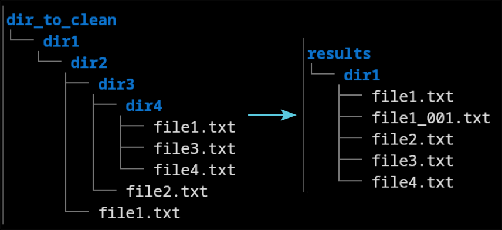
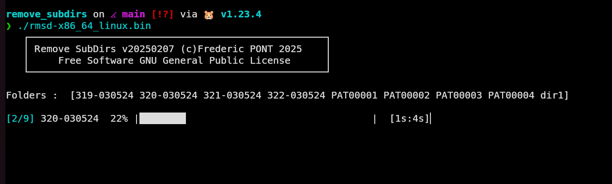

# Remove Sub Directories

This software move all the files in a directory tree in the source directory and removes subdirectories.

# Features
- Compiled binary statically linked : nothing to install
- Clean an unlimited number of directories
- File duplicates detection : a suffix number is append to duplicates
- A copy of the files is made  in the "results" directory without removing the orignal ones

# Quick start
+ copy (or make a symbolic link) the directories to clean in the "dir_to_clean" directory

+ start the software in a terminal :    
./rmsd-x86_64_linux.bin  
rmsd-x86_64_windows.exe  
or double click on the .exe file (Windows)
+ Cleaned directories are in the "results" directoryl

